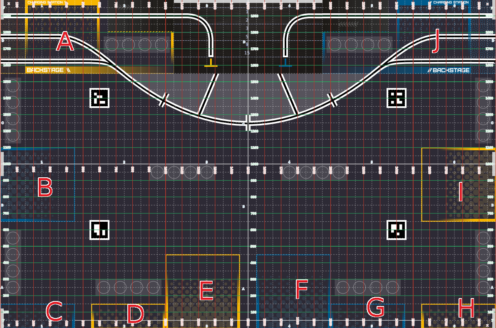

# Navigation Packages for DIT Robotics Eurobot 2025

## 🔧 Features

### 🧭 Basic Navigation  
Enables smooth and efficient autonomous movement.  
- Uses `/nav_to_pose` and `/nav_thru_poses` action servers for basic navigation.

### 🧭 Docking Integration  
Seamlessly integrates docking and navigation for autonomous charging or station return.  
- Utilizes the `/dock_robot` action server to control the docking process.

### 🧩 Multi-Functional Interfaces  
Offers a variety of commands for enhanced control and flexibility:

- `/stopRobot`: Lock/unlock the robot.  
- `/keepout_zone`: Dynamically set keepout zones to avoid certain areas.  
- `/dock_robot`: Supports flexible keyword-based commands via the `dock_type` parameter.  
- `rival_param.yaml`: Supports dynamic rival data setup adjustments.

#### ✅ Stop Robot

Control the robot's emergency stop or resume behavior via the `/stopRobot` topic.

- `true`: Immediately stops and locks the robot.  
- `false`: Unlocks and resumes normal operation.  
- **Message Type**: `std_msgs/msg/Bool`

#### ✅ Keepout Zone Index

The keepout zones correspond to specific regions on the Eurobot 2025 field, used to restrict robot access dynamically via `/keepout_zone`.



- Zones are labeled **A** through **J** on the field map.  
- These zones can be toggled at runtime using the `/keepout_zone` topic.  
- Suitable for strategic behaviors like avoiding opponent areas or obstacle fields.  
- **Message Type**: `std_msgs/msg/String`

#### ✅ Supported Keywords for `/dock_robot` API parameter `/dock_type`
(Keyword order does not matter and is designed for compatibility.)

- **Template Base**:  
  - `dock`: Triggers the docking process.

- **Functional Tags**:  
  - **Controller Type**: `fast`, `slow`, `linearBoost`, `angularBoost`  
  - **Goal Checker Type**: `precise`, `loose`  
  - **Offset Direction**: `x`, `y`, `z`  
  - **Docking Style**: `ordinary`, `gentle`, `rush`  
  - **Special Control**: `delaySpin`

#### ✅ Format for `rival_param.yaml`

```yaml
rival_parameters:
  rival_inscribed_radius: *data(double)*
```

---

## How to Use

1. Download the latest version of `nav2_release_vX.X.X.zip` and extract it into the folder `~/Eurobot-2025/Eurobot-2025-ws`.  
2. Start the container with `Eurobot-2025-Navigation2-envs`.  
3. Launch the navigation packages by executing the appropriate launch files.  

For more details, please refer to the README file at:  
[https://github.com/DIT-ROBOTICS/Eurobot-2025-Navigation2-envs](https://github.com/DIT-ROBOTICS/Eurobot-2025-Navigation2-envs)   

---

## Repository Structure
```
Eurobot-2025
└── Eurobot-2025-ws/
   └── src/
      ├── Eurobot-2025-Navigation2/         # Core navigation system code
         ├── custom_bts/                     # Custom behavior trees
         ├── custom_controller/              # Custom controller plugins
         ├── custom_layer/                   # Custom costmap layers
         ├── navigation2_run/                # Navigation system packages
         ├── Navigation2/                    # Modified version of Nav2
         └── opennav_docking/                # Docking server implementation
      └── Eurobot-2025-Navigation2-envs/    # Docker environments
         ├── Navigation2-humble-local/       # Local PC environment
         └── Navigation2-humble-deploy/      # Remote machine environment

```

---

## Contribution
Contributions are welcome! Please follow these steps:
1. Fork the repository.
2. Create a feature branch.
3. Commit your changes.
4. Submit a pull request.

---

## License
This project is licensed under the MIT License. See the `LICENSE` file for details.

---

## Contact
For any issues or inquiries, please open an issue on GitHub or contact the DIT Robotics team.
